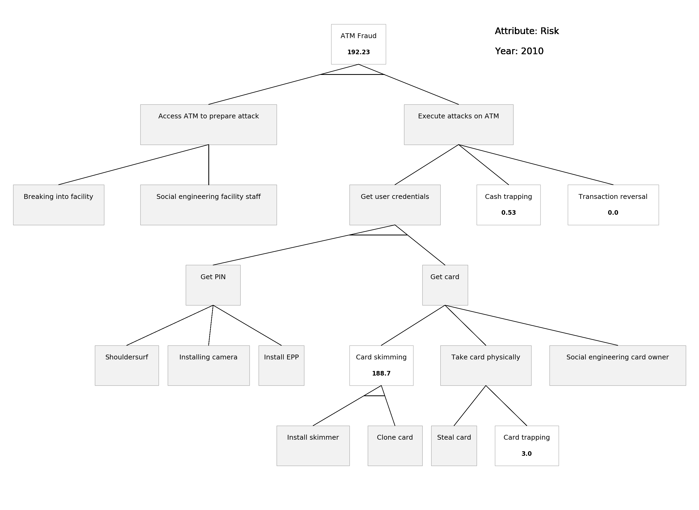
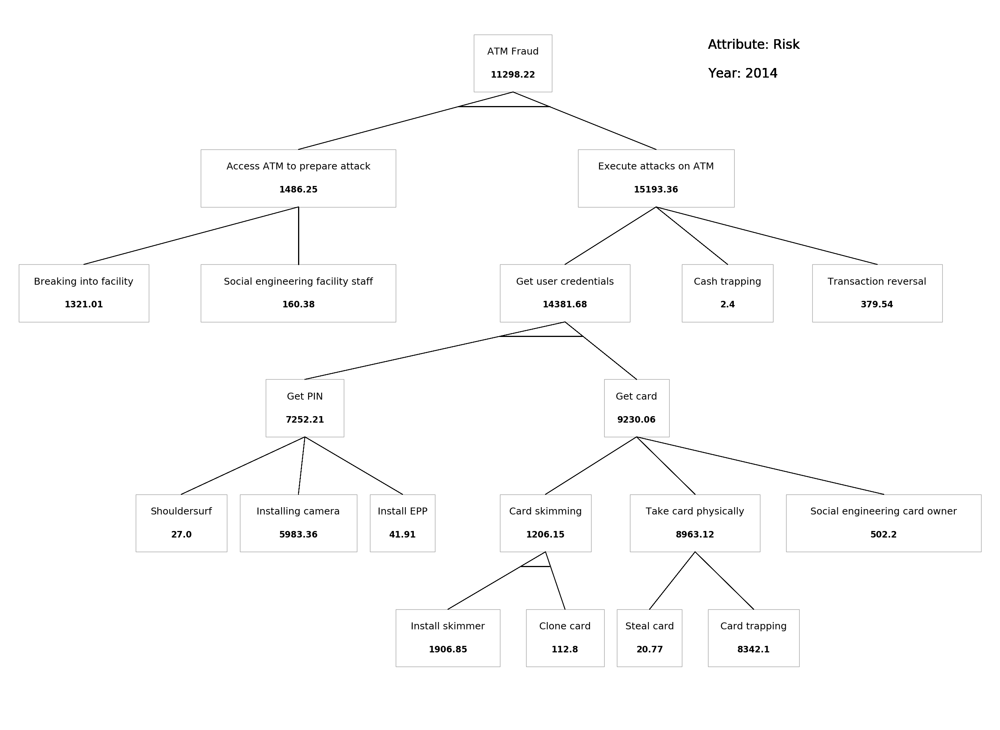
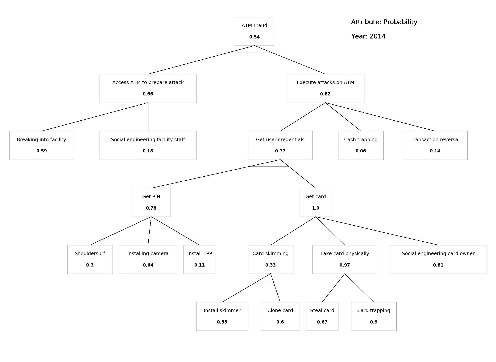

# atreeseries_viz
A visualisation demo for attack-tree series historical view with the ATM fraud attack tree.

# Gif animation:
Observation starts in the first year. For all subsequent years, we mark a node as _red_ if its attribute value has significantly increased, _yellow_ if slightly increased, and _green_ if decreased. If the change over the previous year is less than the order of magnitude of the attribute value, we don't color this node for the current year. 

Used data values are supplied in the data folder.

## Real data:
Observation starts in 2010 and continues till 2015. We only have data for a few nodes, and only those nodes are colored in the demo. Nodes for which we don't have data are displayed in grey.

### Risk over the years (probability * cost to defender):

### Probability only:

## Synthetic data:
Observation starts in 2014 and continues till 2019. We generated synthetic data for all nodes. A script to generate random data is supplied.

### Risk over the years (probability * cost to defender):

### Probability only:

